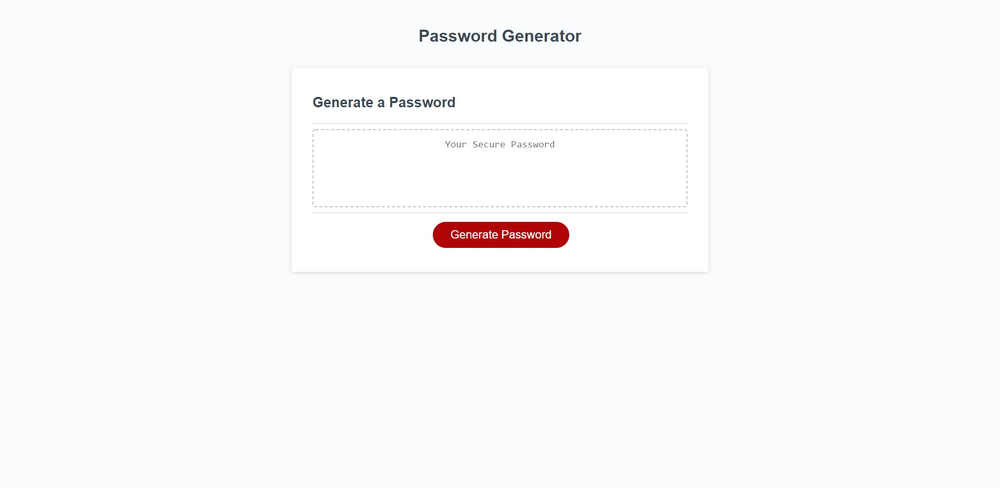
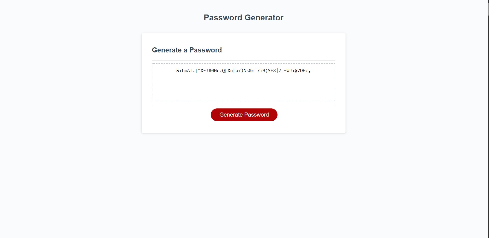

# Password Generator


This is a password generator using JavaScript. The following items are highlights of this repo:

* Button click generates a NEW password

* Password Criteria Prompts

* Prompt for length of password 8 to 128 characters

* Selection of character types to include (lowercase, uppercase, numeric, and/or special characters)

* Password generated that matches selected criteria

* Password is written on page

### Table of Contents

* [Installation](#installation)
* [Hosted Site](#hosted)
* [Screenshots](#screenshots)
* [License](#license)
* [Technologies Used](#technologies%20used)
* [Questions](#questions)

### Installation
Please begin by downloading the files onto your computer. Then open up index.html on your browser.


### Hosted
The app is hosted using GitHub Pages here at this link: [Password Generator](https://ogmedina.github.io/Password-Generator/)
```
Live Site: https://ogmedina.github.io/Password-Generator/
```

### Screenshots 




### License
This project is licensed under the MIT License. 

### Technologies Used:
Front End: 
* HTML
* CSS
* JavaScript


### Questions
If you have any questions about the repo, open an issue or contact me directly at ogmdeveloper0@gmail.com. You can find more of my work through my [GitHub Account](https://github.com/ogmedina/).


### Technologies Used:
#### Front End:
   * HTML
   * CSS
   * JavaScript


### Screenshots


```
Live Site: https://ogmedina.github.io/Homework-PasswordGenerator/
```

