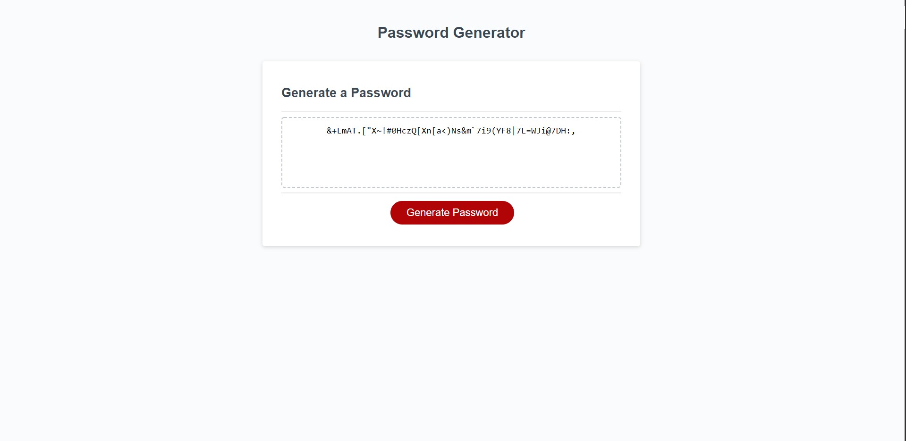

# Homework Javacript: Password Generator

## Full Stack Book Camp Homework 3 - Password Generator

### Description

This is the third assignment for the UTSA Full-Stack Bootcamp. This is a password generator using JavaScript. The following items were the highlights of this assignment:

* Button click generates a NEW password

* Password Criteria Prompts

* Prompt for length of password 8 to 128 characters

* Selection of character types to include (lowercase, uppercase, numeric, and/or special characters)

* Password generated that matches selected criteria

* Password is written on page

### Screenshots

Here is a screenshot of the webpage for the password generator. 

### Deployed Link

Here is a link to the GitHub deployed site: [Password Generator](https://ogmedina.github.io/Homework-PasswordGenerator/)
